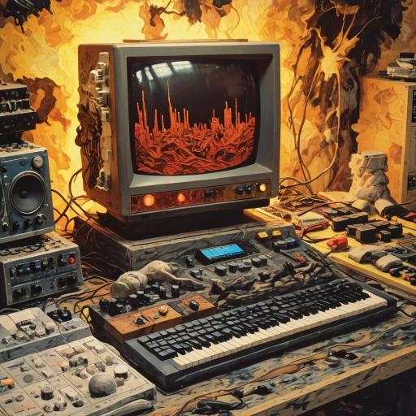
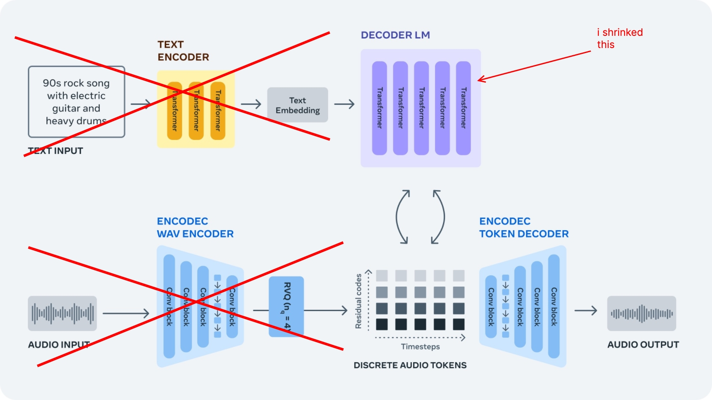
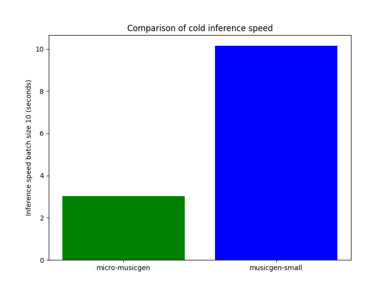
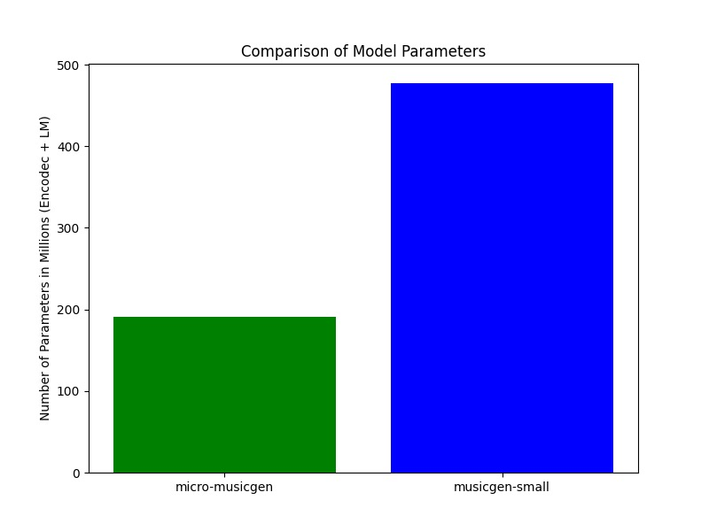

<h1 align="center">
    micro-musicgen
</h1>
<p align="center">
  
</p>

<p align="center">
    A new family of super small music generation models focusing on experimental music and latent space exploration capabilities.
</p>

<p align="center">
    <a 
        href="https://opensource.org/licenses/MIT" 
        target="_blank"
        style="text-decoration: none"
    >
        
    </a>
    <a 
        href="https://huggingface.co/pharoAIsanders420/micro-musicgen-jungle" 
        target="_blank" 
        style="text-decoration: none"
    >
        
    </a>
    <a 
        href="https://twitter.com/mcaaroni" 
        target="_blank"
        style="text-decoration: none"
    >
        
    </a>
</p>

---

> [!WARNING]  
> WARNING: **These models WILL sound bad to a lot of people.** The goal is not create pleasant sounding music,
> but to spark creativity by using the weird sounds of Neural Codecs for music production and sampling!

## Models 

- [micro-musicgen-jungle](https://huggingface.co/pharoAIsanders420/micro-musicgen-jungle)
- ...more coming soon

If you find these model interesting, please consider:

- following me on [Github](https://github.com/aaronabebe)
- following me on [Twitter](https://twitter.com/mcaaroni)


### Goals

My main goals for these models was to be able to train and run **from scratch** on a consumer grade GPU at home.
Also I wanted three main things: **fast iteration speed**, **weird sounds** and **unconditional generation** - the model should inspire me, I can do the rest. 

I DON'T WANT TO GENERATE A FINISHED TRACK.

Based on my personal workflow with music generation models, I experimented with different configurations
and landed on this architecture which offers different advantages and drawbacks.

### Architecture

<p align="center">
  
</p>

image original source: [https://docs.openvino.ai/2024/notebooks/250-music-generation-with-output.html](https://docs.openvino.ai/2024/notebooks/250-music-generation-with-output.html)

My configuration in [micro.yaml](./audiocraft/config/model/lm/model_scale/micro.yaml):

```yaml
# @package _global_

transformer_lm:
  dim: 2048
  num_heads: 2
  num_layers: 2
```

After some experimentation with different datasets, model sizes and train configuration 
I ended up with this language model configuration.
This offered a good mix of small size but enough expressiveness through the increased latent space size.
2 transformer heads and 2 layers were enough to capture most basics of a particular sound or genre
and combined with the under-training still resulted in enough artifacts and weird (perfect) imperfections.

### Speed

I benchmarked comparing vs. `musicgen-small` via `audiocraft` and measured cold-boot inference time with a batch size of `10` and duration of `10 seconds`. 
Test ran on my `GTX 3070` and an `Intel i5 13600K`.

<p align="center">
  
</p>

See [bench.py](./scripts/bench.py).


### Size 

I'm comparing the params for the LM + Encodec since those are the parts that are used for inference in both model sizes.
We land at around `40%` the size of `musicgen-small`. 
This should also reflect the lower VRAM requirements.

<p align="center">
  
</p>

See [size.py](./scripts/size.py).


## Setup 

Basically you can refer to everything from the [original docs](https://github.com/facebookresearch/audiocraft/blob/main/docs/TRAINING.md) 
or for example one of the great community writeups (e.g. [by lyra](https://github.com/lyramakesmusic/finetune-musicgen)) and follow their setup. 
Everything is the same as in the original repo and standard musicgen training except for my model configuration and run params.

## Training 

```bash
dora run solver=musicgen/musicgen_base_32khz model/lm/model_scale=micro conditioner=none dataset.batch_size=3 dset=audio/jungle dataset.valid.num_samples=1 generate.every=10000 evaluate.every=10000 optim.optimizer=adamw optim.lr=1e-4 optim.adam.weight_decay=0.01 checkpoint.save_every=5
```

### Explanations

| Param                          | Description                                                                                       |
|------------------------------------------|---------------------------------------------------------------------------------------------------|
| `model/lm/model_scale=micro`             | Use my smaller custom language model architecture.                                                 |
| `conditioner=none`                       | No conditioner applied during training.                                                           |
| `dataset.batch_size=3`                   | Maximum batch size that my GPU could handle, adjustable based on GPU capacity.                     |
| `dset=audio/jungle`                      | The dataset you wanna train.                                |
| `dataset.valid.num_samples=1`            | Validation is not important (in this case), just takes up unneccesary training time.              |
| `generate.every=10000 evaluate.every=10000` | Hacky workaround to skip generation/evaluation stages for faster training. If you know something better please let me know!                                    |

The rest is pretty standard I'd say.

### Runs

TODO add section

### Data

TODO add section


## FAQ

#### Are the models not just overfitting on snippets of the trainset? 
Not sure, probably yes? But doesn't really matter for this use case I'd say, still sounds cool.

#### The model I trained sounds like shit, why? 
Probably expected, I'd say it only works for more abstract stuff - don't expect it to generate your favorite hiphop beats to study to.

#### Why only 32kHz? Why no DAC? 
I tried DAC but the pretrained one somehow fails with these small amounts of data. 
I think Encodec somehow works better with the LM's but can't really say why. 
Also DAC is way slower to train and run, so I decided against it.

#### Why only mono?
Let's be real, stereo Encodec just sucks.

#### Why do I need to use your fork for one single config file?
If you dont want to use my fork, there's actually just one bug that it fixes compared to main.
See [this commit](https://github.com/facebookresearch/audiocraft/commit/da42b790d3213b373d17a1c496961c209eb16075?diff=split&w=0) and just add it yourself.

## Next steps

- [ ] finish README
- [ ] create colab / HF space for demoing
- [ ] write custom inference script to get more optimizations 
- [ ] train more models, try smaller architectures


